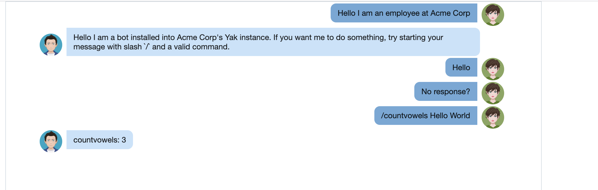
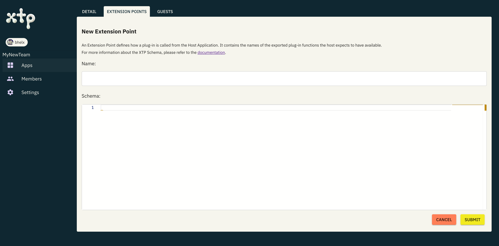

# XTP Onboarding Exercise

> *Time to Complete*: 15 minutes

## Overview

In this exercise, you'll take on the role of a messaging company providing a SaaS,
multi-tenant chat application, similar to Slack. Let’s call it Yak. It’s ideal for endless
chatter and yakking away. Your platform is popular for its built-in slash command feature,
and now your customers want the ability to add their own custom commands.
To meet this demand, you will add an extension system to your platform using XTP.

## Prerequisites

- [git](https://git-scm.com/downloads)
- [npm & node.js](https://nodejs.org/en/download/package-manager)
- [extism-js compiler](https://github.com/extism/js-pdk?tab=readme-ov-file#install-the-compiler)
- An ice cold coffee or other beverage of choice

## Video Walkthrough

If you're not able to run through this guide yourself yet, watch one of us go through the steps in this video:

[](https://youtu.be/GQZ1Wcy1cQM?t=914)

> *Note*: There have been some UI and flow changes to XTP since this video was recorded. Use this README as the definitive guide.

## Step 1: Clone the Repository and Launch Yak

Clone [this repository](https://github.com/dylibso/xtp-integration-exercise) which contains the code for the Yak platform.

```shell
git clone https://github.com/dylibso/xtp-integration-exercise.git
```

Install the required dependencies and start the application:

```bash
npm install
npm run dev
```

Open up [http://localhost:3000](http://localhost:3000) in your browser:

You should see the following:


> **Note**: If you are not seeing this, check the server logs

You are logged into your customer Acme Inc's instance and it's just you and the bot.

Type some messages into the chat and you'll see the bot does not respond. The bot only responds to
slash commands. To try some built-in commands start your message with `/`. You'll see a popup with built-in commands. Try `/countvowels Hello World`. The bot should respond with `countvowels: 3`

Try out the built-in commands by typing “/” into the message box. You should at least see goodies such as `countvowels`.



> **Note**: If you are not seeing this or getting an error, check the server logs

These built-in commands are a real treat, but as we mentioned before, your users want more customization.
So let’s integrate XTP into Yak so customers like Acme Inc can augment their Yak instance with their own slash commands!

## Step 3: Add a plugin system to Yak using XTP

First, you'll need to make sure [you have an XTP account](https://xtp.dylibso.com/sign-up)
and [you have created a team](https://xtp.dylibso.com/~/teams/new). You can name your team whatever you want.

With your new team in hand, let’s setup an [Extension Point](https://docs.xtp.dylibso.com/docs/overview#extension-point)
for the Host App (i.e., Yak).

### Step 3a: Configure an Extension Point

Choose your app, navigate to the `Extension Points` tab and select the `Add Extension Point` button. You should now see the following:



Let's name the Extension Point `SlashCommand` to indicate that Yak customers, such as Acme Inc., will use it to deploy their own custom slash commands.

Next we’ll need to define a schema that sets up the interface between the Host application (i.e., Yak) and any plugins pushed to this Extension Point.

Copy and paste the following into the Schema box:

```yaml
version: v1-draft
exports:
  handleMessage:
    description: Called when a message is sent to this plugin.
    input:
      contentType: application/json
      description: The message without the slash command
      $ref: "#/components/schemas/Message"
    output:
      contentType: application/json
      description: The message you will reply with as the bot
      $ref: "#/components/schemas/Message"
components:
  schemas:
    MessageType:
      description: Tells the application how to interpret this message.
      enum:
      - html
      - text
      - image
    Message:
      description: A message from the system
      properties:
        body:
          type: string
          description: The message body. Depends on the type
        type:
          $ref: "#/components/schemas/MessageType"
        nick:
          type: string
          description: The nickname of the originator of the message
          nullable: true
```

Click `Submit` and congrats you now have an Extension Point in Yak!

> **Note**: Don’t worry about the details of this schema just yet; there will be plenty of time for that later. If you're curious, you can find more information [here](https://docs.xtp.dylibso.com/docs/host-usage/xtp-schema).

### Step 3b: Integrate XTP with Yak

Now that XTP knows more details about how and where you’re adding extensibility to Yak
(via the Extension Point configuration we just created), we’re ready to modify Yak itself with the ability to retrieve and execute plugins.

Since the Yak server is written in JavaScript, we’ll do this by using the XTP JS SDK.
The SDK will equip Yak with the following capabilities:

1. Retrieve plugins from the XTP plugin registry that have been deployed by Yak customers, such as Acme Inc.
2. Execute those plugins in-process using an embedded plugin execution engine

> *Note*: That’s right, we’re going to execute 3rd party, arbitrary code (safely) right inside of Yak!

To make this easy, we've put all the command handling code into the file [commands.js](./commands.js).
First let's start by created a client to connect to the XTP API. Paste this on the top of the file:

```javascript
// command.js

import createClient from '@dylibso/xtp'

const xtpClient = await createClient({
  appId: '<app-id>',
  token: String(process.env.XTP_TOKEN),
  // typescript plug-ins need WASI, this is a minor detail that isn't important at the moment
  useWasi: true
})
```

> **Note**: Get your app id by clicking on the `Detail` tab from your app view. Or pull it out of the url.

> **Note**: Generate a token from your user view here: [https://xtp.dylibso.com/tokens](https://xtp.dylibso.com/~/tokens).
> This is a secret. Store it in the environment variable XTP_TOKEN and restart the server.

Now that the client is initialized, there are two places we need to extend:

1. Where the available command names are listed
2. Where the messages are processed

For the first, let's extend `getCommands()`. This currently returns the list of built-in command names.
We will append on the result of `xtpClient.listAvailablePlugins()` which will return the commands installed at the
logged in guest account.

```javascript
const GUEST_KEY = 'acme-corp'
const EXT_NAME = 'SlashCommand'

// change this implementation to include guest commands
export async function getCommands() {
  return Object.keys(BUILTIN_COMMANDS).concat(await xtpClient.listAvailablePlugins(
    EXT_NAME,
    GUEST_KEY,
  ))
}
```

Next we need to add the ability to execute these custom commands. To do that we must modify `commandHandler`:

```javascript
// add this helper function
async function runSlashCommand(commandName, message) {
  // our Extension Point is:             `SlashCommand`
  // our export that we want to call is: `handleMessage`
  const pluginFunc = xtpClient.extensionPoints.SlashCommand.handleMessage

  const result = await pluginFunc(
    GUEST_KEY,
    JSON.stringify(message), // The plug-in expects a json Message
    {
      // this is by default the name of our plugin,
      // which is the name of the command
      bindingName: commandName,
      default: "{}"
    }
  )
  return JSON.parse(result)
}

// modify commandHandler
export async function commandHandler(message) {
// ...

  const command = BUILTIN_COMMANDS[commandName]
  if (command) {
    botMessage = command(message)
  } else { // add this else clause
    // if we fail to find the command in the built-ins, let's check xtp
    const pluginCommands = await xtpClient.listAvailablePlugins(
      EXT_NAME,
      GUEST_KEY,
    )
    if (pluginCommands.includes(commandName)) {
      // running a plugin is no different than calling a normal function
      // but it's sandboxed and language independent thanks to Wasm
      botMessage = await runSlashCommand(commandName, message)
    }
  }

// ...
}
```

> **Note**: Plugins are scoped by the Extension Point and a Guest Key, with the Guest Key identifying the plugin's creator, such as Acme Inc.

From the Yak side we’re now all ready to go. See how easy that was?! Now let’s make sure things are working properly from the Guest side, by setting up a Guest account for testing purposes.

> **Note**: Before moving on, run `npm run dev` and make sure the application is running as normal. Leave it running for the next step.


## Step 4: Add a Guest Account for Acme Inc.

In order for the Acme company to be able to push plugins to your newly established Extension Point, they’ll need an [XTP User Account](https://docs.xtp.dylibso.com/docs/overview#user-account) that has [Guest](https://docs.xtp.dylibso.com/docs/overview#guest) access to your [XTP Host App](https://docs.xtp.dylibso.com/docs/overview#host-app) (i,.e., Yak). 

Normally the guest would be one of your users and a third party, to make testing easier, we're going to invite ourselves as a guest.

First you need to install the CLI in your terminal:

```bash
curl https://static.dylibso.com/cli/install.sh | bash
```

Start by making sure that you're logged into the `xtp` CLI. Running the command
below will open a browser window asking you to login.

```shell
$ xtp auth login
```


Once you've approved the login, close the browser window. Now we can add ourselves
as a guest. We're going to use `"acme-corp"` as our guest key since we are pretending to be Acme.

> **Note**: Normally you will invite guests via the API and they have their own account. For this demo we are just going to
add ourselves as a guest.

In order to add yourself as a guest.

1. Navigate to your app in the dashboard
2. Click the `Guests` tab
3. Click the `Add yourself` button
4. Click the auto-generated guest key and change it to `acme-corp`
5. Hit <enter>

You are now authencated as the guest `acme-corp` in your app and can push plug-ins into this guest key.

## Step 4: Deploy a Plugin

Now let’s pretend you’re Acme Inc. (the "Guest" in XTP nomenclature) and deploy a plugin. 

Let's create a plugin called `loudify` that will reflect back the incoming message but all caps.
To generate a new plug-in project for a Slash command, use `plugin init`:

```bash
xtp plugin init
```

- Select the `SlashCommand` Extension Point
- Select TypeScript as the language
- Set a path for XTP to generate the plugin scaffolding (./loudify)
- Navigate to the plugin directory/open it an in an IDE

Open `main.ts` and fill out this implementation for `handleMessageImpl`:

```typescript
// main.ts

export function handleMessageImpl(input: Message): Message {
  return {
    type: MessageType.text,
    body: input.body.toUpperCase()
  }
}
```

This will get called by Yak when it gets the `/loudify` command. So all we're doing returning a new message
uppercasing the body of the input message.

Now to install the code in Yak, from the plugin directory, run these two commands:

```
# Build and install the plugin
xtp plugin push
```

If all goes well, then you should be done; rebooting Yak is not required! Typing `/loud` in the
message box should now show that `loudify` is a valid command. And sending a message like `/loudify hello world`
should respond with the loudified message.

## Next Steps

Hopefully, this guided flow has given you a glimpse of XTP's capabilities and empowered you to add extensibility to your own applications. The possibilities are endless. For more information, explore the product documentation and join us on [Discord](https://extism.org/discord) if you encounter any issues or have ideas to enhance XTP's functionality.
